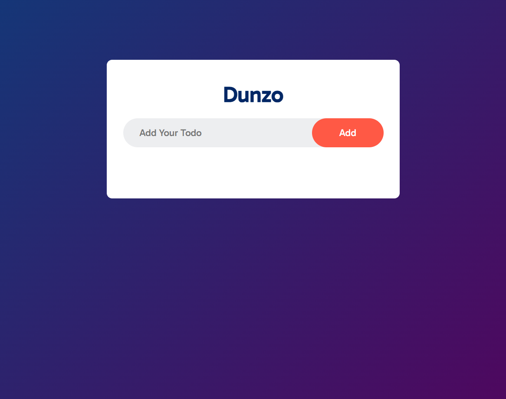
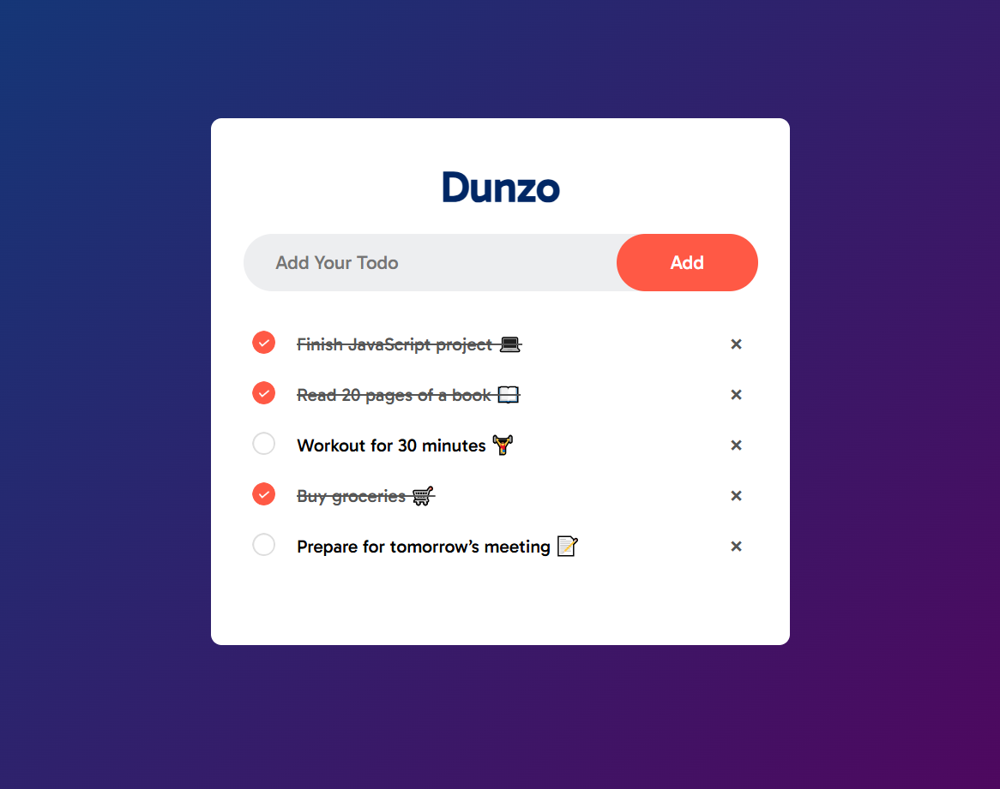
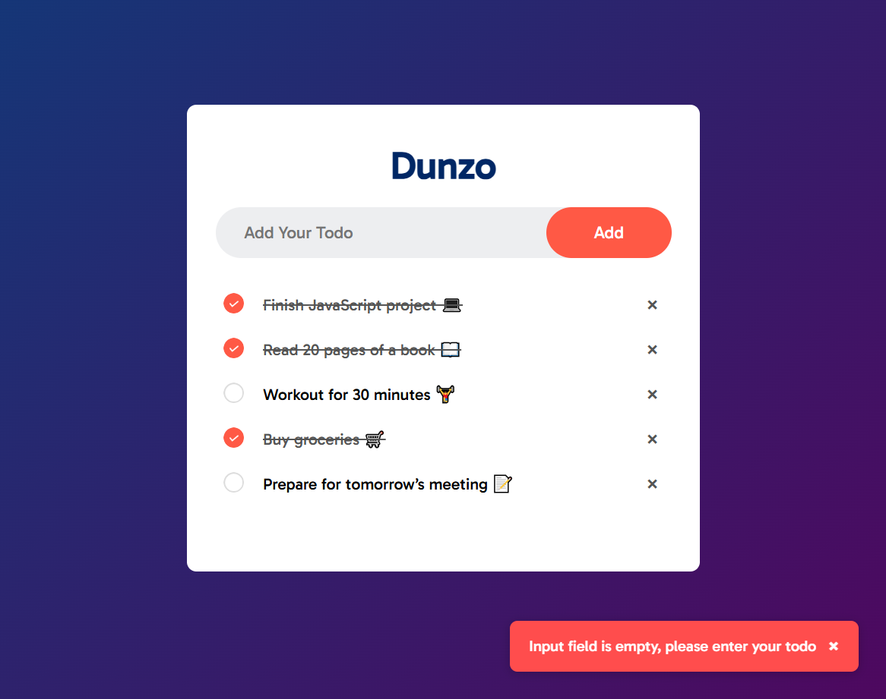

# **📝 Dunzo - Simple Todo Application**

- **Dunzo** is a clean, responsive, and lightweight todo application designed to help users stay organized and productive throughout their day. With its intuitive controls and visually pleasant user interface, users can effortlessly add, complete, and delete tasks in just a few clicks. Dunzo also features persistent data storage using `localStorage`, ensuring that your tasks remain saved even after refreshing or closing the browser. Whether you're managing daily chores, planning a project, or organizing your thoughts, Dunzo provides a simple yet effective tool to stay on top of your tasks.

# **🚀 Features**

- ✅ **Add Todos**: Users can type their tasks and add them instantly to the list.
- 🔄 **Toggle Completion**: Clicking on a todo item toggles its completed state (adds a strike-through effect).
- ❌ **Remove Todos**: Each todo has a remove button to delete the task from the list.
- ⚠️ **Validation**: If the user clicks `Add` without typing anything, a friendly toast message appears indicating the input is required.
- 💾 **Local Storage Persistence**: Todos are saved in the browser's local storage, so your tasks remain even after reloading the page.

# **📸 App Screens**

 

 

